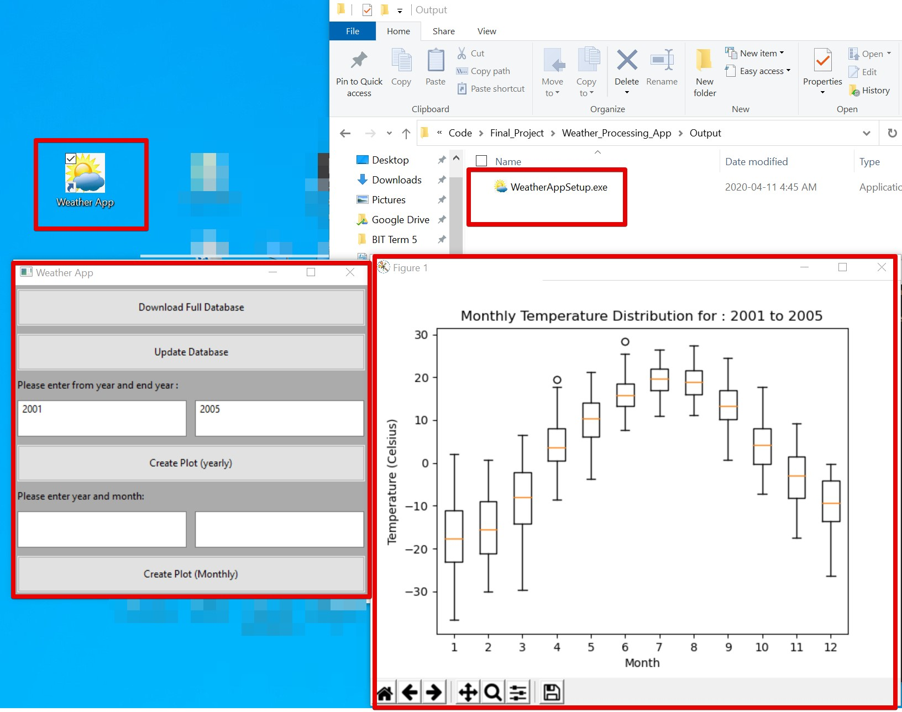
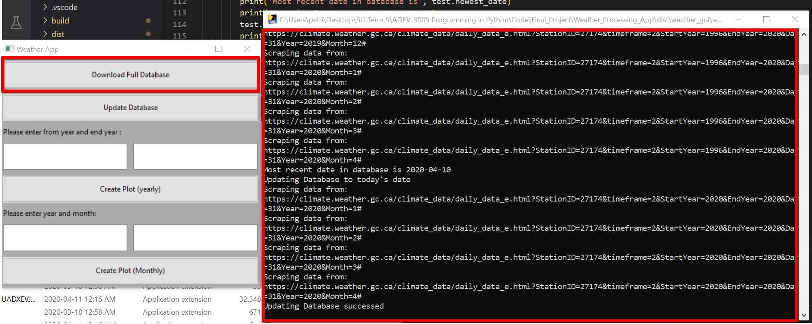
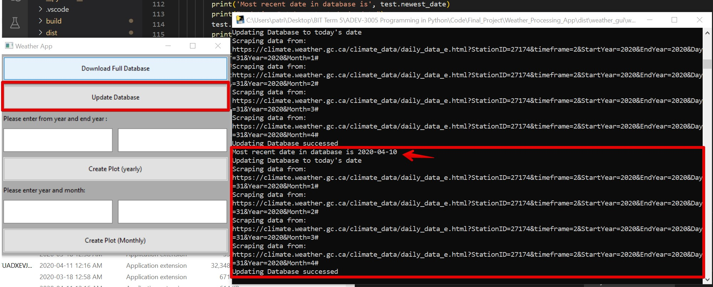
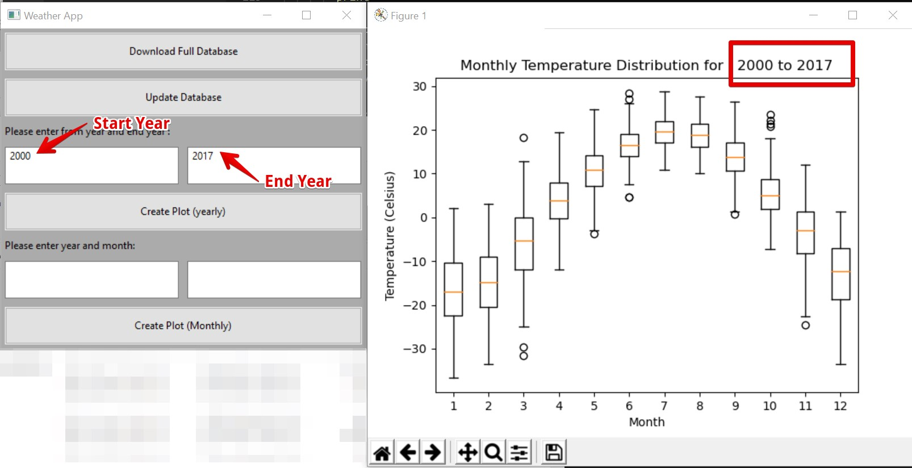
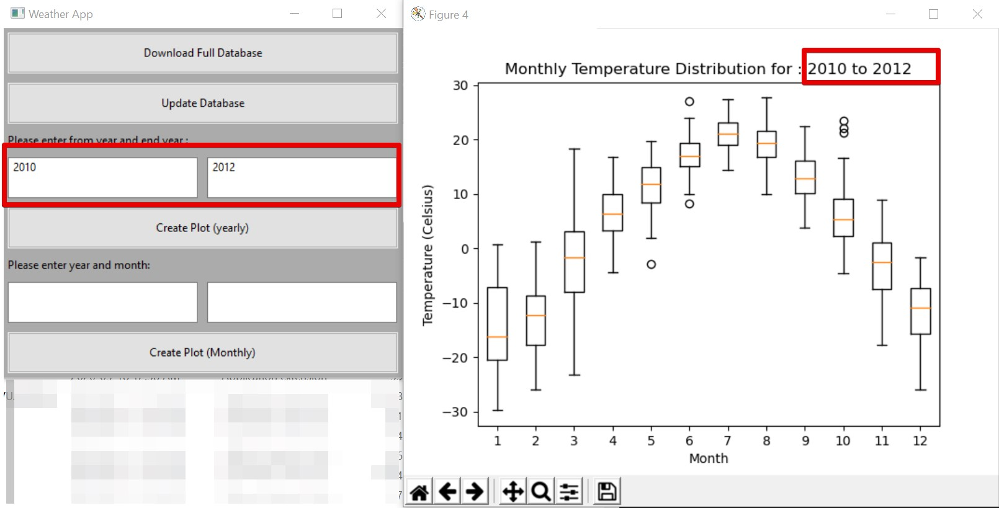
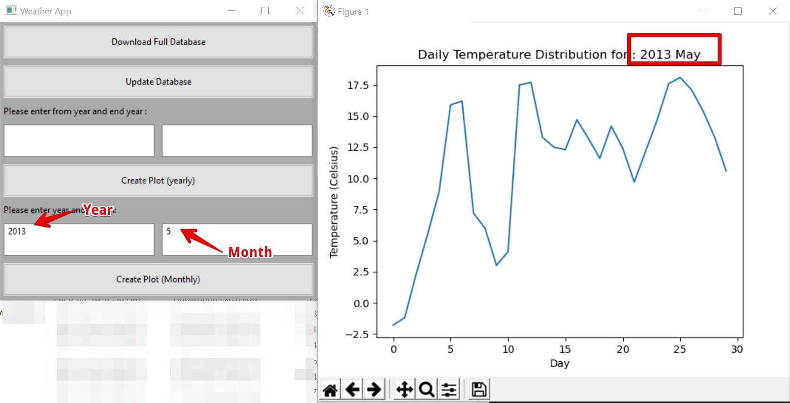

# Canadian historic weather plot app

This app uses python HTMLParse to scrap the winnipeg histoical weather data from [Weather Canada](https://climate.weather.gc.ca/historical_data/search_historic_data_e.html). And generate different plot use matplotlib.

### Program Overview

The windows install file _WeatherAppSetup.exe_ is located in ./Output

### Download fullset of Database

This function will go to [Weather Canada](https://climate.weather.gc.ca/historical_data/search_historic_data_e.html) scrape the minimum, maximum and mean temperature from the earliest data avaliable to current date data.

### Update Database

This function will go to current database and check the lastest year, and update to current year.

### Create yearly weather plot

This function is to generate the yearly mean temperature plot.
User inputs are:

- Start Year
- End Year

### Create yearly weather plot

This function will generate the plot for the single month of the year.
User inputs are:

- Year
- Month (1 for Jan, 2 for Feb,etc..)

